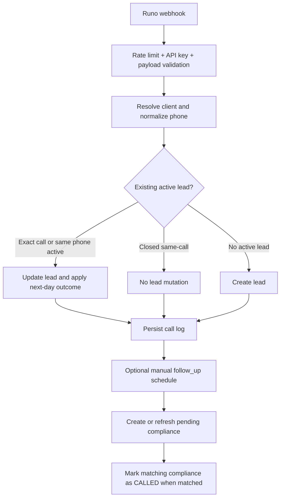

# PixelEye Complete Workflow (Frontend + Backend)

This is the full technical workflow reference for all PixelEye pages, APIs, logic, and decision paths.

It covers:

- every PixelEye frontend page
- all PixelEye backend endpoints
- webhook ingestion and same-phone lifecycle
- notification and compliance schedulers
- day-wise status progression rules
- role-based behavior and restrictions

---

## 1. PixelEye Modules At A Glance

### Frontend modules

- Main Leads page: `frontend/src/components/sections/pixel-eye/index.tsx`
- Leads table + inline actions: `frontend/src/components/sections/pixel-eye/pixelEyeTable.tsx`
- Follow-ups page: `frontend/src/components/sections/pixel-eye-follow-ups/index.tsx`
- Lead detail page: `frontend/src/components/sections/pixel-eye-lead-detail/index.tsx`
- Overview dashboard: `frontend/src/components/sections/pixel-eye-overview/DashboardPage.tsx`
- Notification tracker: `frontend/src/components/sections/pixel-eye-notification-tracker/index.tsx`
- Shared data hooks: `frontend/src/components/hooks/usePixelEyeQuery.tsx`, `frontend/src/components/hooks/usePixelEyeNotificationsQuery.tsx`
- Shared status rules: `frontend/src/components/sections/pixel-eye/pixelEyeStatuses.ts`

### Backend modules

- API routes: `backend/src/modules/pixelEye/pixelEye.routes.js`
- Webhook route: `backend/src/modules/pixelEye/webhook/pixelEyeWebhook.routes.js`
- Controllers: `backend/src/modules/pixelEye/pixelEye.controller.js`, `backend/src/modules/pixelEye/webhook/pixelEyeWebhook.controller.js`
- Lead service: `backend/src/modules/pixelEye/pixelEye.service.js`
- Notification state service: `backend/src/modules/pixelEye/pixelEyeNotification.service.js`
- Webhook business flow: `backend/src/modules/pixelEye/webhook/pixelEyeWebhook.service.js`
- Compliance service: `backend/src/modules/pixelEye/pixelEyeFollowUpCallCompliance.service.js`
- Follow-up history service: `backend/src/modules/pixelEye/pixelEyeFollowUpHistory.service.js`
- Call-log service: `backend/src/modules/pixelEye/pixelEyeCallLog.service.js`
- Schedulers: `backend/src/modules/pixelEye/pixelEyeScheduler.js`, `backend/src/modules/pixelEye/pixelEyeFollowUpComplianceScheduler.js`

### Startup integration

- Backend app bootstrap, migration ensures, and scheduler start: `backend/src/app.js`

---

## 2. Frontend Route Map

Defined in `frontend/src/routes/router.tsx` and `frontend/src/routes/paths.ts`.

- Leads page route: `/pages/d/:clientKey/leads`
- Lead detail route: `/pixel-eye/leads/:leadId`
- Follow-ups route: `/pixel-eye/follow-ups`
- Dynamic dashboard route: `/pages/d/:clientKey/:tableId`
  - `tableId=overview` renders PixelEye overview dashboard
  - `tableId=notification-tracker` renders PixelEye notification tracker

---

## 3. Backend API Surface

Base path: `/api/v1/pixeleye`

### Lead CRUD and exports

- `GET /` list leads
- `GET /export?format=csv|pdf&dateFrom=&dateTo=&agent=` export leads
- `GET /:id` get one lead
- `POST /` create lead (validated)
- `PATCH /:id` update lead (validated)
- `DELETE /:id` hard delete lead (management role)

### Follow-up and outcome APIs

- `PATCH /:id/follow-up-outcome` apply next day outcome
- `PATCH /:id/follow-up/reschedule` reschedule manual follow-up
- `PATCH /:id/follow-up/cancel` cancel or permanently close follow-up
- `GET /:id/follow-up/history` follow-up date audit trail

### Notification and compliance APIs

- `GET /notifications`
- `GET /notifications/summary`
- `GET /follow-ups/call-compliance`
- `GET /follow-ups/missed-calls`
- `GET /follow-ups/call-compliance-summary`

### Webhook API

- `POST /webhook`
  - middleware chain: rate-limit, security headers, API key verify, request logging, payload normalize/validate

---

## 4. Data Tables And Their Purpose

- `PixelEye`
  - primary lead row, status + day_1..day_5 + follow_up_date
- `PixelEyeLeadState`
  - reminder engine state (scheduled/completed/cancelled/baseline, schedule type, reason, permanently_closed)
- `PixelEyeFollowUpHistory`
  - follow_up_date audit history (created/updated/cleared/rescheduled/auto-from-webhook)
- `PixelEyeCallLog`
  - normalized webhook call logs + raw payload + outcome marker
- `PixelEyeFollowUpCallCompliance`
  - pending/called/missed/ignored/cancelled follow-up call SLA rows

---

## 5. Status And Day Decision Logic

### Canonical status set

- Backend enum source: `backend/src/database/tables/PixelEyeTable/index.js`
- Frontend source: `frontend/src/components/sections/pixel-eye/pixelEyeStatuses.ts`
- Legacy statuses are normalized in backend via `normalizePixelEyeStatus`.

### Day dropdown rules

- Day 1..4 allowed set =
  - its corresponding DNP only (`DNP 1`, `DNP 2`, `DNP 3`, `DNP 4`) +
  - 24-hour statuses +
  - 48-hour statuses +
  - non-DNP/non-24h/non-48h statuses excluding the 30-minute callback-only bucket
- Day 5 allowed set =
  - stop-flow style statuses; excludes `-` and `Medicine`

### Outcome progression model

- Outcome update API always fills the next empty day only.
- If all day fields are filled or reminder flow is closed, outcome update is blocked.
- Day updates must be sequential. You cannot fill day 3 if day 2 is empty.

### Lead active vs closed decision

Lead is treated as inactive/closed if any of these is true:

- all `day_1..day_5` are filled
- main status is terminal (termination/no-action category)
- reminder state is cancelled/permanently closed

Otherwise lead is active.

---

## 6. Role-Based Logic

### Backend enforcement

- All PixelEye APIs (except webhook) require auth + tenant context.
- `DELETE` requires management-role middleware.
- Client role restrictions in update flow:
  - cannot directly patch `day_1..day_5` or day/value pair in generic update
  - must use structured outcome endpoint for day progression
  - cannot directly overwrite existing follow_up_date (must use reschedule endpoint)

### Frontend behavior

- Leads table:
  - client users route day edits to `PATCH /:id/follow-up-outcome`
  - admin/super-admin can patch day fields directly (still backend validated)
- Lead detail:
  - clients use structured next-day outcome dropdown
  - admin/super-admin can edit specific day fields

---

## 7. Page-by-Page Workflow

## 7.1 Leads Page

Files:

- `frontend/src/pages/pixel-eye/index.tsx`
- `frontend/src/components/sections/pixel-eye/index.tsx`
- `frontend/src/components/sections/pixel-eye/pixelEyeTable.tsx`

### Features

- list all leads for tenant/client
- search/filter in UI
- create lead drawer
- edit lead drawer
- inline status/day/follow_up_date edits
- delete drawer
- CSV/PDF export

### APIs used

- `GET /api/v1/pixeleye`
- `POST /api/v1/pixeleye`
- `PATCH /api/v1/pixeleye/:id`
- `PATCH /api/v1/pixeleye/:id/follow-up-outcome` (for client role day progression)
- `DELETE /api/v1/pixeleye/:id`

### Important logic decisions

- create with duplicate active same-phone lead updates existing row instead of creating new row
- follow_up_date is validated as future schedule when provided
- cache invalidation after mutations refreshes leads, lead detail, notifications, and compliance summary queries

---

## 7.2 Overview Dashboard Page

Files:

- `frontend/src/pages/dynamic/index.tsx`
- `frontend/src/components/sections/pixel-eye-overview/DashboardPage.tsx`
- `frontend/src/components/sections/pixel-eye-overview/dashboardUtils.ts`

### Features

- KPI cards, funnel, trend, follow-up analytics
- filters by date range and agent
- computes metrics client-side from lead list

### APIs used

- `GET /api/v1/pixeleye`

### Important logic decisions

- terminal/cancelled/completed reminder states are excluded from active follow-up metrics
- follow-up dashboard helpers distinguish converted, follow-up, lost, invalid, in-progress buckets

---

## 7.3 Follow-Ups Page

Files:

- `frontend/src/pages/pixel-eye/follow-ups.tsx`
- `frontend/src/components/sections/pixel-eye-follow-ups/index.tsx`

### Features

- manual follow-up queue with bucket segmentation (overdue/today/tomorrow/week/all)
- missed calls bucket from compliance table
- action drawers for reschedule/cancel
- structured outcome update from follow-up queue

### APIs used

- `GET /api/v1/pixeleye`
- `GET /api/v1/pixeleye/follow-ups/missed-calls`
- `GET /api/v1/pixeleye/follow-ups/call-compliance-summary`
- `GET /api/v1/pixeleye/:id`
- `PATCH /api/v1/pixeleye/:id/follow-up/reschedule`
- `PATCH /api/v1/pixeleye/:id/follow-up/cancel`
- `PATCH /api/v1/pixeleye/:id/follow-up-outcome`

### Important logic decisions

- queue is follow_up_date-driven (manual follow-up date), not generic reminder scheduled_at
- closed/cancelled/permanently closed leads are removed from actionable queue
- missed bucket is sourced from compliance status `MISSED`

---

## 7.4 Lead Detail Page

Files:

- `frontend/src/pages/pixel-eye/lead-detail.tsx`
- `frontend/src/components/sections/pixel-eye-lead-detail/index.tsx`

### Features

- single lead inspection
- day pipeline display and update
- reminder state panel
- follow-up history timeline
- compliance rows for that lead/call
- CRM actions: reschedule, cancel, and update outcome

### APIs used

- `GET /api/v1/pixeleye/:id`
- `GET /api/v1/pixeleye/:id/follow-up/history`
- `GET /api/v1/pixeleye/follow-ups/call-compliance`
- `PATCH /api/v1/pixeleye/:id`
- `PATCH /api/v1/pixeleye/:id/follow-up-outcome`
- `PATCH /api/v1/pixeleye/:id/follow-up/reschedule`
- `PATCH /api/v1/pixeleye/:id/follow-up/cancel`

### Important logic decisions

- client role cannot directly edit arbitrary day fields from detail view
- terminal day outcome can propagate to main status in UI payload path
- detail view refreshes lead, history, and compliance queries after each action

---

## 7.5 Notification Tracker Page

Files:

- `frontend/src/pages/dynamic/index.tsx`
- `frontend/src/components/sections/pixel-eye-notification-tracker/index.tsx`

### Features

- monitor reminder engine states
- scheduled/completed/cancelled counts
- filter by state, schedule type, date range, search
- row detail drawer

### APIs used

- `GET /api/v1/pixeleye/notifications`
- `GET /api/v1/pixeleye/notifications/summary`

---

## 8. Backend Business Flows

## 8.1 Manual Create Flow

1. Validate and normalize payload (`validatePixelEyeCreate`).
2. Resolve tenant/client context (super-admin can pass `_client_key`).
3. Find same normalized phone in same client.
4. If active same-phone lead exists: update existing lead and return duplicate update response.
5. Else create new lead with day fields null.
6. If follow_up_date exists and valid future: schedule manual reminder and create pending compliance row.
7. If status implies terminal closure, flow closes accordingly.

## 8.2 Generic Update Flow

1. Validate payload (`validatePixelEyeUpdate`).
2. Enforce role and day update rules.
3. Enforce sequential day updates.
4. Normalize phone if changed.
5. If follow_up_date changed:
   - validate future datetime
   - schedule manual reminder if eligible
   - refresh pending compliance row
   - write follow-up history
6. If status changed: run status notification engine.
7. If a day field changed: run day notification engine.

## 8.3 Structured Outcome Flow (`PATCH /:id/follow-up-outcome`)

1. Validate outcome status.
2. Find next empty day.
3. Verify status is allowed for that day.
4. Update that day field atomically.
5. Trigger day-based reminder scheduling logic.
6. Clear existing follow_up_date (if present) and create history record for clearing.

## 8.4 Reschedule Flow

1. Require active non-closed lead.
2. Require valid future follow_up_date.
3. Update lead follow_up_date.
4. Cancel previous pending compliance for the lead.
5. Schedule new manual reminder.
6. Create new pending compliance row.
7. Write follow-up history entry as `RESCHEDULED`.

## 8.5 Cancel Flow

1. Optional status/reason accepted.
2. Determine whether cancellation should permanently close flow.
3. Update/create reminder state row as cancelled.
4. Persist cancel reason and closure flags.

## 8.6 Delete Flow (Hard Delete)

Transactionally removes:

- lead row
- reminder state rows
- pending/history compliance rows
- follow-up history rows
- call log rows

All under tenant/client scope.

---

## 9. Webhook (Runo) Complete Flow

Files:

- `backend/src/modules/pixelEye/webhook/pixelEyeWebhook.routes.js`
- `backend/src/modules/pixelEye/webhook/pixelEyeWebhook.controller.js`
- `backend/src/modules/pixelEye/webhook/pixelEyeWebhook.service.js`
- `backend/src/middlewares/validation/pixelEyeWebhookValidation.js`

### Ingestion sequence

1. Apply webhook rate limit.
2. Verify webhook API key.
3. Normalize payload to Runo-style structure.
4. Validate required fields (`call_id`, customer, phone, date/time, status).
5. Resolve client by `_client_key`/`client_key`/env default.
6. Normalize phone.
7. Persist call log (always best effort).
8. Determine lead mutation path:
   - exact same call_id active lead: update existing
   - same phone active lead: update existing
   - closed same-call lead: no mutation (log only)
   - no active lead: create new
9. Apply next-day outcome once per call-log outcome marker.
10. If manual follow_up_date present and valid future: schedule manual reminder.
11. Create/update pending compliance row where applicable.
12. Mark matching compliance row as `CALLED` when webhook call log matches pending reminder window.

### Key webhook decisions

- idempotency-like behavior via call-log outcome markers
- same-phone identity uses `client_id + normalized_phone_number`
- closed flow is protected from accidental re-open by webhook mutation

---

## 10. Reminder And Compliance Engines

## 10.1 Reminder Scheduler

File: `backend/src/modules/pixelEye/pixelEyeScheduler.js`

- cadence: every 1 minute
- processes due reminder states and sends notifications
- no-overlap guard + lag monitoring

## 10.2 Follow-Up Compliance Scheduler

File: `backend/src/modules/pixelEye/pixelEyeFollowUpComplianceScheduler.js`

- cadence: every 15 minutes
- scans pending compliance rows with `allowed_until <= now`
- resolves final state:
  - `CALLED`: matching call found
  - `IGNORED`: lead closed/cancelled/terminal
  - `MISSED`: no matching call within allowed window

## 10.3 Reminder category mapping

From status category in notification service:

- `THIRTY_MIN` statuses -> schedule in 30 minutes
- `DNP2` statuses -> schedule in 24 hours
- `TWENTY_FOUR_HR` statuses -> schedule in 24 hours
- `FORTY_EIGHT_HR` statuses -> schedule in 48 hours
- `MANUAL` -> schedule at follow_up_date timestamp
- `TERMINATION`/`NO_ACTION` -> cancel/close flow
- `NO_REMINDER`/`UNKNOWN` -> baseline state, no callback scheduled

---

## 11. End-To-End Flow Charts

### 11.1 UI -> API -> State

```mermaid
flowchart TD
   A[User action on PixelEye page] --> B[Frontend hook mutation/query]
   B --> C[/api/v1/pixeleye endpoint]
   C --> D[Controller]
   D --> E[Service logic + validation rules]
   E --> F[(PixelEye + LeadState + History + CallLog + Compliance)]
   F --> G[JSON response]
   G --> H[React Query invalidate/refetch]
   H --> I[Updated UI]
```

### 11.2 Webhook lifecycle



---

## 12. Validation And Error Behavior

### Manual APIs

- create/update/outcome use Joi validation middleware
- invalid status/day pairing returns 400
- duplicate conflicts can return 409
- unauthorized/tenant mismatch returns 403/404 pattern depending on lookup path

### Webhook API

- malformed payload returns 400
- duplicate/conflict markers return 409 when applicable
- unknown server failures return 500

### Common protection checks

- invalid phone normalization is rejected
- follow_up_date must be future when scheduling manual reminder
- cannot reschedule/cancel closed terminal workflows in disallowed paths

---

## 13. Final Reference Matrix (Page -> APIs -> Core Logic)

| Page                 | APIs                                                                                                                                                                                 | Core Logic                                                  |
| -------------------- | ------------------------------------------------------------------------------------------------------------------------------------------------------------------------------------ | ----------------------------------------------------------- |
| Leads                | `GET /`, `POST /`, `PATCH /:id`, `PATCH /:id/follow-up-outcome`, `DELETE /:id`, `GET /export`                                                                                        | CRUD, duplicate active same-phone merge, inline progression |
| Overview             | `GET /`                                                                                                                                                                              | KPI and funnel derivation from lead set                     |
| Follow-ups           | `GET /`, `GET /follow-ups/missed-calls`, `GET /follow-ups/call-compliance-summary`, `PATCH /:id/follow-up/reschedule`, `PATCH /:id/follow-up/cancel`, `PATCH /:id/follow-up-outcome` | manual queue + missed SLA management                        |
| Lead Detail          | `GET /:id`, `GET /:id/follow-up/history`, `GET /follow-ups/call-compliance`, `PATCH /:id`, `PATCH /:id/follow-up-*`                                                                  | single-lead CRM actions + audit + compliance view           |
| Notification Tracker | `GET /notifications`, `GET /notifications/summary`                                                                                                                                   | reminder engine state observability                         |

---

## 14. Practical Notes

- The entire PixelEye flow is tenant-scoped.
- Super-admin can scope by `_client_key`; non-super-admin uses JWT tenant context.
- Reminder and compliance are separate but connected subsystems:
  - reminder state controls callback scheduling
  - compliance state verifies whether follow-up calls actually happened
- Day progression is strict and intentionally guarded to preserve follow-up lifecycle consistency.
